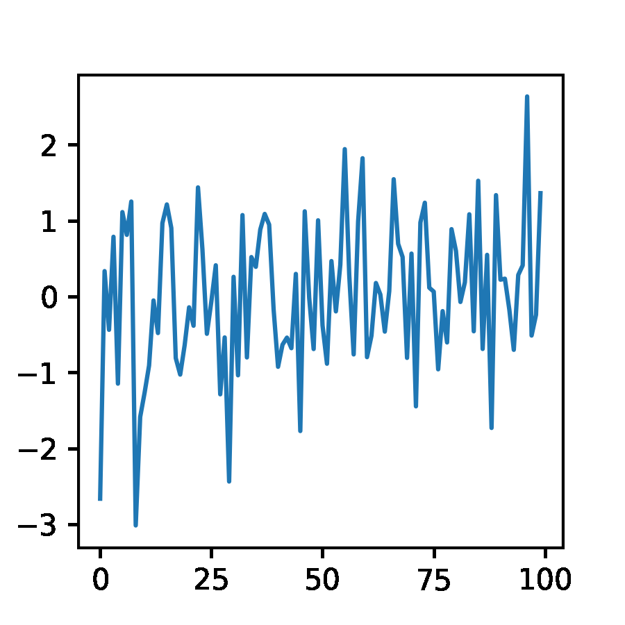
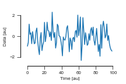

# nutil

Lazy functions for Jupyter notebooks

Installing:

    pip install git+https://github.com/anki-xyz/nutil

## Browsing

Fast image browsing based on PIL and IPython display.

Usage:

    import numpy as np
    from nutil.image import browse

    x = np.random.randint(0, 255, (10, 200, 200))

    browse(x, cmap='viridis')

## Plot features

How to grab a figure to an RGB image numpy array:

    from nutil.plot import grabFigure
    from imageio import mimwrite

    ims = []

    for _ in range(10):
        fig = plt.figure()
        plt.plot(np.random.randn(100))
        ims.append(grabFigure(fig))

    mimwrite("random_plot.gif", ims, fps=3) 

Use this function to make your paper figures nice immediately (and editable in Illustrator & Co!).
Checkout the [example file](nice_figure.svg) in SVG file format.

    import seaborn as sns
    from nutil.plot import paperStyle

    # Font-size 8 pt by default,
    # text editable
    # and seaborn white style with ticks
    paperStyle()
    
    plt.figure(figsize=(3,2))
    plt.plot(np.random.randn(100))
    plt.xlabel("Time [au]")
    plt.ylabel("Data [au]")
    sns.despine(trim=True, offset=5)
    plt.savefig("nice_figure.png")
    plt.savefig("nice_figure.svg")

## Fake data

Moving square

    from nutil.fake import movingSquare
    ms = movingSquare()
